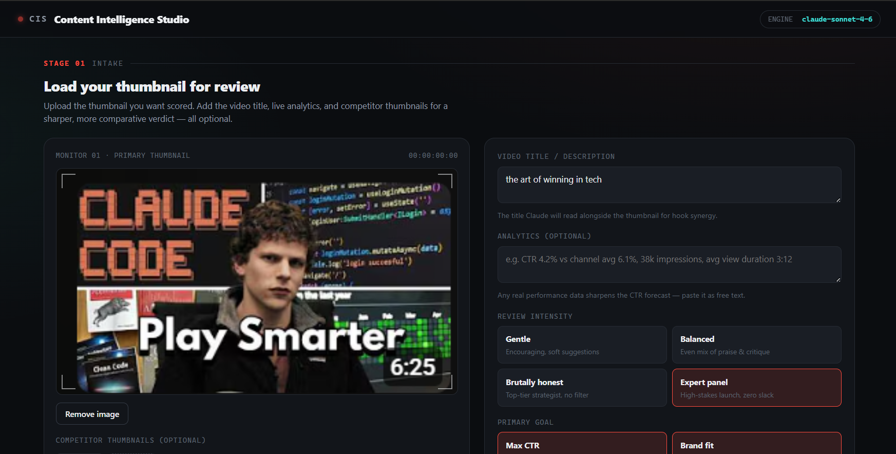
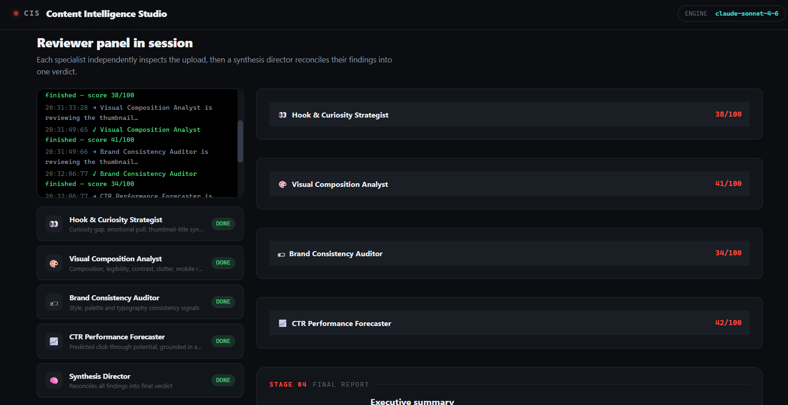
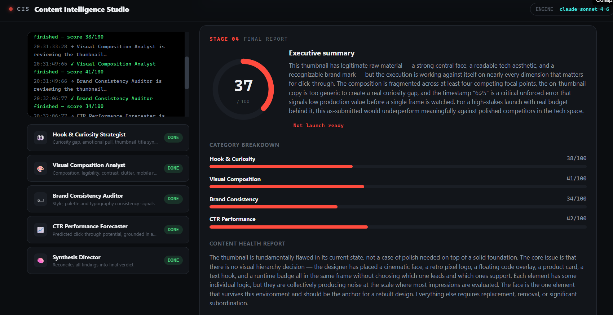
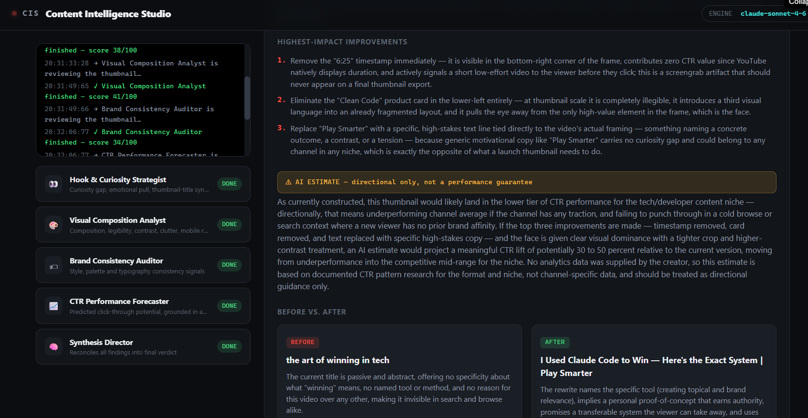
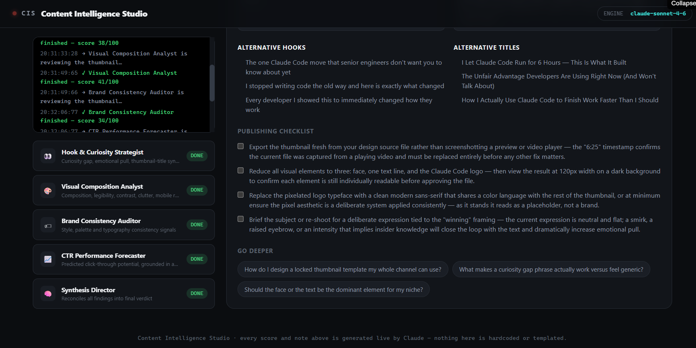

Day 47
Build Content Intelligence Studio
Create an AI-Powered Content Analysis Platform

# Content Intelligence Studio

An AI-powered application that evaluates YouTube thumbnails using a panel of specialized AI reviewers. The system analyzes visual composition, branding, CTR potential, and curiosity factors before generating a comprehensive launch readiness report with actionable recommendations.

---

# 📸 Project Screenshots

## 1. Upload Thumbnail Interface

Upload a thumbnail, provide the video title, configure review intensity, choose optimization goals, and optionally compare against competitor thumbnails.

---

## 2. Thumbnail Loaded

The uploaded thumbnail is displayed alongside metadata inputs before the AI review process begins.

---

## 3. AI Reviewer Panel

A panel of specialized AI reviewers independently analyzes the thumbnail while live execution logs show each agent's progress.

Agents include:

- Hook & Curiosity Strategist
- Visual Composition Analyst
- Brand Consistency Auditor
- CTR Performance Forecaster
- Synthesis Director

---

## 4. Executive Summary Report

The final report combines all reviewer outputs into one comprehensive score.

Displayed metrics include:

- Overall Thumbnail Score
- Launch Readiness
- Executive Summary
- Category Breakdown
- Content Health Report

---

## 5. Improvement Recommendations

The studio highlights the highest-impact improvements that will most likely increase click-through rate.

Examples include:

- Remove unnecessary visual clutter
- Improve headline curiosity
- Strengthen visual hierarchy
- Increase brand consistency

---

## 6. Hooks, Titles & Publishing Checklist

The final section generates optimized hooks, alternative video titles, publishing suggestions, and creator checklists for maximizing thumbnail performance.

---

# 🌐 Generated HTML File

The generated HTML contains the complete AI application, including:

- Modern dashboard interface
- Thumbnail upload system
- AI review pipeline
- Multi-agent execution
- Final report generation
- Responsive design
- Interactive UI components

---

# 📊 Content Analysis Report

## Overall Score

**37 / 100**

**Status:** ❌ Not Launch Ready

---

## Category Scores

| Category | Score |
|----------|------:|
| Hook & Curiosity | 38/100 |
| Visual Composition | 41/100 |
| Brand Consistency | 34/100 |
| CTR Performance | 42/100 |

---

## Executive Summary

The uploaded thumbnail contains promising visual elements but lacks a clear visual hierarchy. Multiple competing focal points reduce readability, while the headline does not create a strong curiosity gap. Overall branding and composition require refinement before publication.

---

## Major Findings

### Hook & Curiosity

- Generic messaging
- Weak emotional trigger
- Low curiosity gap
- No compelling reason to click

---

### Visual Composition

- Excessive visual clutter
- Competing focal points
- Poor information hierarchy
- Thumbnail becomes difficult to scan at smaller sizes

---

### Brand Consistency

- Mixed typography
- Inconsistent design language
- Weak visual identity
- Branding elements lack cohesion

---

### CTR Forecast

The AI predicts below-average click-through performance due to:

- Weak headline
- Busy composition
- Generic messaging
- Low contrast between important visual elements

---

# 🚀 Recommended Improvements

1. Remove unnecessary visual distractions.
2. Focus on a single dominant subject.
3. Replace generic text with curiosity-driven copy.
4. Strengthen branding consistency.
5. Increase contrast and readability.
6. Simplify the layout.
7. Create a stronger emotional trigger.
8. Optimize the thumbnail specifically for mobile viewing.

---

# 💡 Key Learnings

### Multi-Agent Evaluation Produces Better Insights

Instead of relying on one generalized AI response, specialized reviewers can independently analyze different aspects of creative content.

---

### CTR Depends on More Than Design

A visually attractive thumbnail may still perform poorly if it lacks curiosity, emotional appeal, or a compelling value proposition.

---

### Visual Hierarchy Matters

The eye should immediately identify the primary subject. Too many competing elements reduce engagement.

---

### Branding Should Be Consistent

Consistent typography, colors, and layout improve recognition across multiple uploads.

---

### Actionable Feedback Is More Valuable Than Scores

Detailed recommendations, rewritten titles, and publishing checklists provide creators with clear next steps for improvement.

---

# 🛠 Technologies Used

- HTML5
- CSS3
- JavaScript
- Claude Sonnet 4.6
- Multi-Agent AI Workflow
- Responsive UI Design

---

# 🎯 Features

- Thumbnail Upload
- AI Multi-Agent Review
- Hook Analysis
- Visual Composition Analysis
- Brand Consistency Review
- CTR Prediction
- Executive Summary
- Improvement Suggestions
- Before vs After Recommendations
- Alternative Titles
- Publishing Checklist
- Responsive Dashboard

---

# 📌 Conclusion

Content Intelligence Studio demonstrates how multiple specialized AI reviewers can collaborate to evaluate YouTube thumbnails from different perspectives. By combining composition analysis, branding evaluation, CTR forecasting, and hook optimization into a unified workflow, the application delivers practical, data-driven recommendations that help creators improve content performance before publishing.
