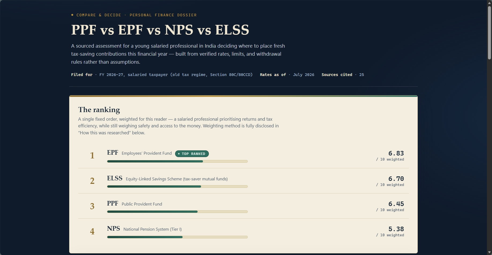
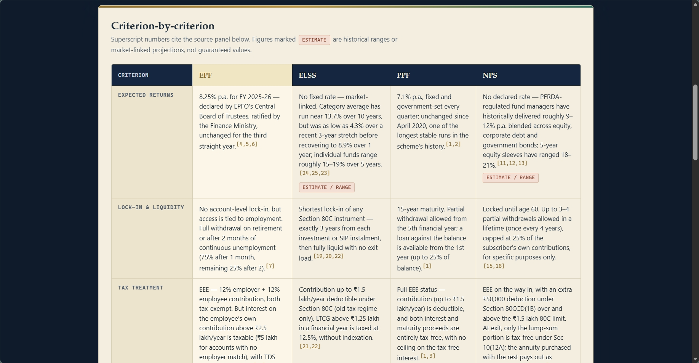
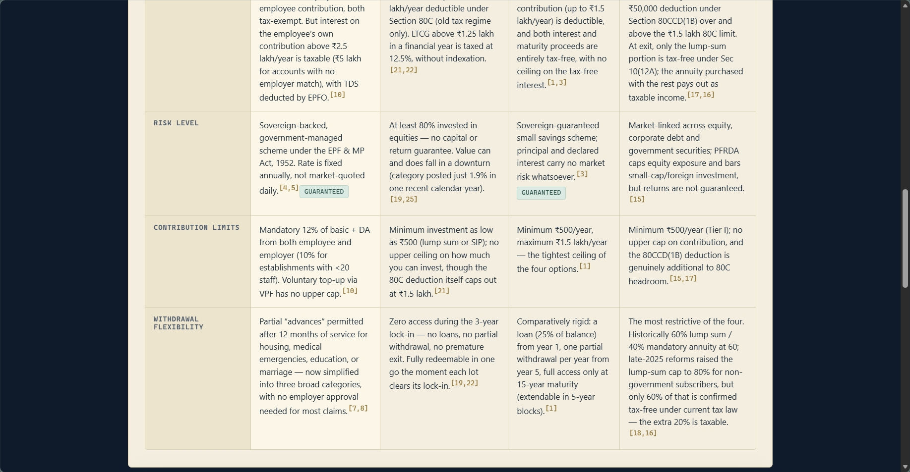
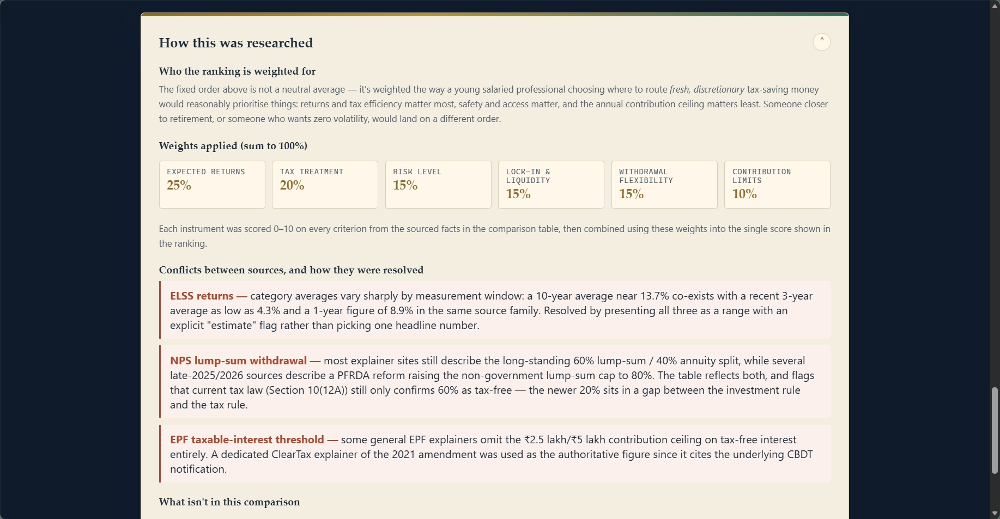
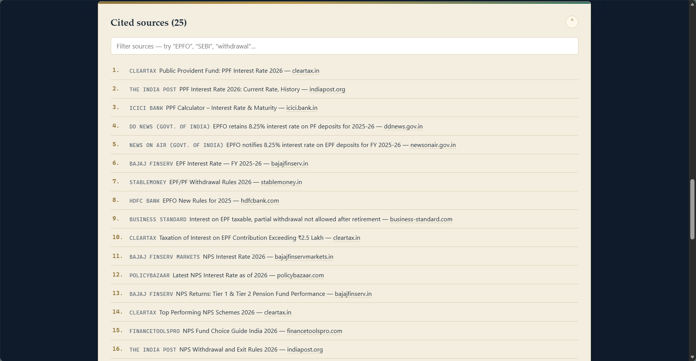

# The Verdict Engine – Documentation

## 📌 Overview

**The Verdict Engine** is a research-driven financial comparison tool that evaluates four of India's most popular tax-saving investment options:

- **EPF (Employees' Provident Fund)**
- **ELSS (Equity Linked Savings Scheme)**
- **PPF (Public Provident Fund)**
- **NPS (National Pension System)**

Unlike generic comparison articles, this application ranks investment options using a transparent weighted scoring model backed by **25 verified sources**. Every recommendation is supported by cited references, making the decision process explainable and evidence-based. :contentReference[oaicite:0]{index=0}

---

# 📸 Screenshots

## 1. Home Dashboard & Final Ranking

Displays the overall ranking of tax-saving instruments using weighted scores based on expected returns, tax benefits, liquidity, risk, withdrawal flexibility, and contribution limits.

---

## 2. Criterion-by-Criterion Comparison

Provides a side-by-side comparison of every investment option across all major evaluation criteria. Each fact is supported with inline citations linked to its original source.

 Extended Comparison Table

Continues the detailed comparison with contribution limits, withdrawal flexibility, risk profile, and taxation rules for each investment instrument.

---

## 3. Research Methodology

Explains exactly how rankings were calculated, including:

- Target audience
- Weight distribution
- Scoring methodology
- Source conflicts
- Resolution process
- Scope limitations

This section makes the recommendation fully transparent.

---

## 5. Cited Sources

Lists all references used throughout the report with searchable filtering. Every comparison claim links back to one or more verified sources for maximum credibility.

---

# 🖥 Generated HTML File

The application was built as a completely self-contained HTML document featuring:

- Responsive layout
- Interactive ranking engine
- Dynamic weighted scoring
- Searchable citation panel
- Expandable research methodology
- Interactive comparison tables
- Pure HTML, CSS and JavaScript implementation

The HTML defines the full application structure, styling, scoring engine, methodology, and interactive source navigation. :contentReference[oaicite:1]{index=1}

---

# 📊 Sourced Data Report

The Verdict Engine evaluates every investment across six weighted criteria:

| Criterion | Weight |
|-----------|---------:|
| Expected Returns | 25% |
| Tax Treatment | 20% |
| Risk Level | 15% |
| Lock-in & Liquidity | 15% |
| Withdrawal Flexibility | 15% |
| Contribution Limits | 10% |

Each investment receives criterion scores that are combined into a final weighted score, producing a transparent ranking. :contentReference[oaicite:2]{index=2}

### Data Sources

The report references **25 authoritative sources**, including:

- EPFO
- Government of India publications
- SEBI Investor Education
- ClearTax
- India Post
- ICICI Bank
- HDFC Bank
- PolicyBazaar
- Business Standard
- Bajaj Finserv
- StableMoney

Every statement shown in the comparison table includes inline source citations that connect directly to the source list. :contentReference[oaicite:3]{index=3}

---

# 🚀 Features

- ✅ Evidence-based ranking engine
- ✅ Weighted scoring algorithm
- ✅ Transparent research methodology
- ✅ Interactive comparison table
- ✅ Source citation system
- ✅ Searchable bibliography
- ✅ Responsive user interface
- ✅ Dynamic score calculation
- ✅ Collapsible research sections
- ✅ Pure client-side implementation

---

# 💡 Key Learnings

### Research Transparency Matters

A recommendation is significantly more trustworthy when users can inspect the methodology instead of relying on unexplained rankings.

### Explainable AI Improves Trust

Showing *why* a recommendation was made builds confidence far better than presenting only a final score.

### Weighting Changes Outcomes

Different investor priorities (returns, liquidity, tax efficiency, safety) can lead to different rankings, making customizable weighting an important design consideration.

### Source Attribution Adds Credibility

Connecting every comparison point to verified references allows users to validate information independently.

### Good UX Simplifies Complex Decisions

Interactive tables, expandable research notes, searchable citations, and visual rankings make detailed financial comparisons easier to understand.

---

# ✅ Project Outcome

The Verdict Engine successfully combines financial research, weighted decision-making, and transparent documentation into a single interactive web application. It transforms complex investment comparisons into an explainable, source-backed recommendation system while maintaining complete traceability for every conclusion.
