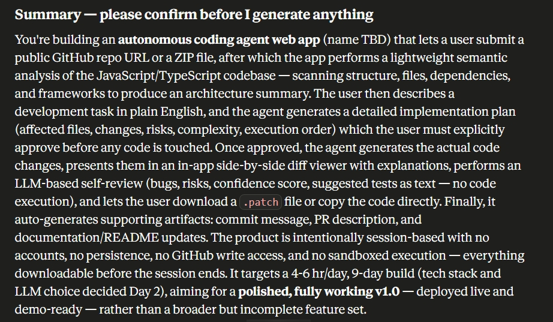
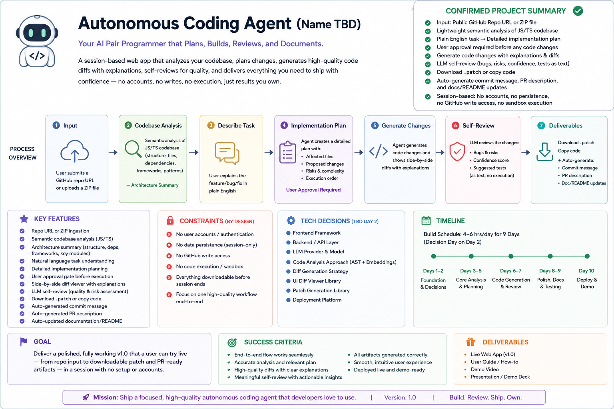

# Autonomous Coding Agent – Documentation

## Overview

This repository contains the documentation and deliverables for building an **Autonomous Coding Agent**. The application analyzes JavaScript/TypeScript repositories, generates implementation plans, creates AI-assisted code changes after user approval, performs self-review, and produces development artifacts such as patch files, commit messages, PR descriptions, and documentation updates.

---

# Deliverables

## 1. Interview

Completed the project discovery interview to define:

- Product vision
- Core workflow
- User journey
- Technical constraints
- MVP scope
- Success criteria

---

## 2. Approved Project Summary

Finalized the project scope, including:

- Repository analysis from GitHub URL or ZIP upload
- Architecture summary generation
- AI-generated implementation planning
- User approval before code generation
- Side-by-side code diff viewer
- AI self-review
- Downloadable patch file
- Auto-generated commit message
- Pull Request description
- Documentation updates

---

## 3. Product Requirements Document (PRD)

Prepared a comprehensive PRD covering:

- Product Overview
- Problem Statement
- Goals & Objectives
- User Personas
- Functional Requirements
- Non-Functional Requirements
- User Flow
- Technical Requirements
- MVP Scope
- Success Metrics

---

## 4. Implementation Blueprint

Created a detailed implementation roadmap including:

- Development timeline (Days 2–10)
- Frontend architecture
- Backend architecture
- AI workflow
- Repository analysis pipeline
- Code generation process
- Self-review workflow
- Testing strategy
- Deployment checklist

---

## 5. Pitch Deck

Designed a presentation containing:

- Product Vision
- Problem
- Solution
- Features
- System Workflow
- Technical Architecture
- Development Roadmap
- Business Value
- Future Enhancements
- Demo Strategy

---

# Key Learnings

## Product Planning

- Clearly defining the MVP prevents unnecessary feature expansion.
- User approval before code generation increases transparency and trust.
- Separating planning from execution improves implementation quality.

## AI Integration

- Repository context significantly improves generated code quality.
- AI-generated implementation plans reduce development ambiguity.
- Structured prompts lead to more reliable outputs.

## Development Workflow

- Breaking development into analysis, planning, implementation, and review simplifies the overall workflow.
- Presenting code changes as visual diffs enhances usability.
- AI self-review helps identify potential risks before deployment.

## Documentation

- Automatically generating commit messages and PR descriptions saves developer time.
- Keeping documentation synchronized with generated code improves maintainability.
- Downloadable artifacts allow users to retain complete ownership of generated outputs.

## Product Design

- A session-based architecture eliminates the need for authentication.
- Avoiding GitHub write access reduces security concerns.
- A lightweight architecture enables faster deployment and easier maintenance.

---

# Planned Technology Stack

- React
- TypeScript
- Node.js
- Express.js
- Tailwind CSS
- Monaco Editor
- Diff Viewer Library
- OpenAI or Claude API
- Vercel (Deployment)

---

# Outcome

Successfully planned a polished MVP capable of:

- Repository analysis
- Architecture summarization
- AI-assisted implementation planning
- User approval workflow
- Code generation
- Side-by-side diff visualization
- AI self-review
- Patch generation
- Automated documentation
- Commit message generation
- Pull Request description generation

---

---

## Status

**Project Documentation:** ✅ Complete

**Implementation Plan:** ✅ Complete

**Ready for Development:** ✅
Commit URL
https://github.com/reemaz01/codeAgent/commit/7b9ec765b30059975e652c6a6a7789d3638d893f

