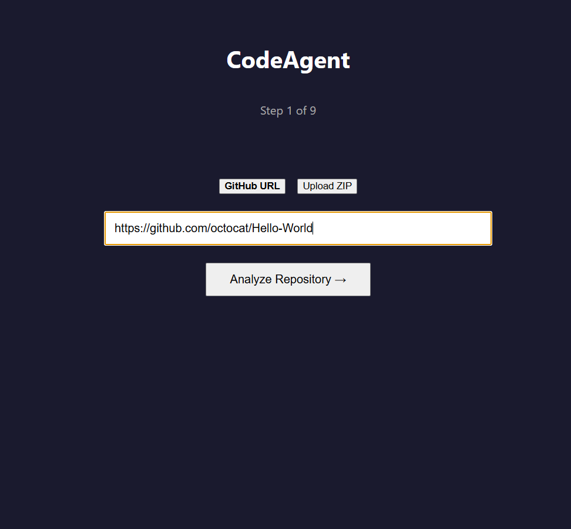
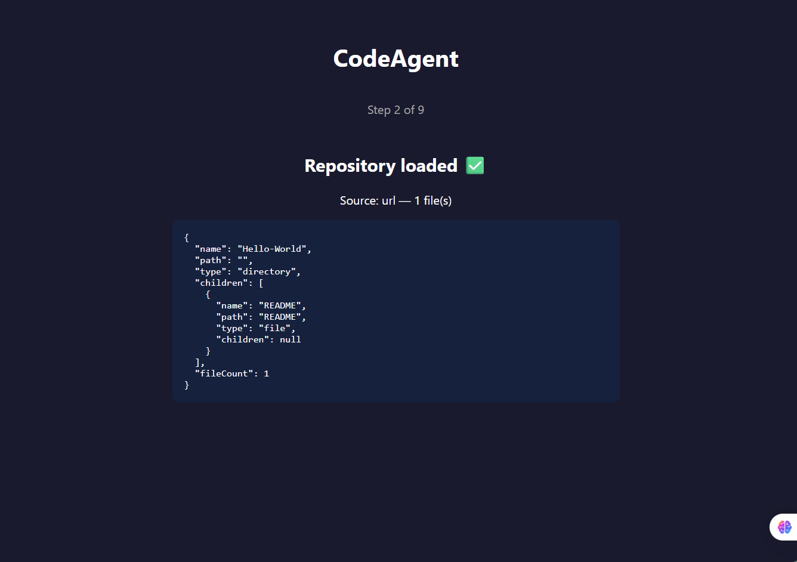

Capstone Project — Day 3 of 10
Day 53
Project Setup & Foundation
Capstone Day 3: From System Design to a Running Hello World


# Day 3 Documentation – CodeAgent

> **Repository:** CodeAgent  
> **Day:** 3 – Repository Ingestion 

---

# Working Hello World / Repository Ingestion

## Screenshot 1 – Step 1 (Repository Input)



- Application running locally
- GitHub URL input working
- ZIP upload option available
- Ready to analyze repositories

---

## Screenshot 2 – Repository Loaded Successfully



Repository ingestion completed successfully.

Verified:

- GitHub repository cloned
- File tree generated
- Backend API responding
- Frontend displaying repository structure
- Session created successfully

---

# SETUP.md

See:

[SETUP.md](SETUP.md)

Contents include:

- Prerequisites
- Backend installation
- Frontend installation
- Environment configuration
- Running locally
- Connectivity verification
- Common troubleshooting

---

# PROJECT-STRUCTURE.md

See:

[PROJECT-STRUCTURE.md](PROJECT-STRUCTURE.md)

Documents:

- Complete folder hierarchy
- Backend architecture
- Frontend architecture
- Services
- Routes
- Context
- Future implementation locations

---

# ENVIRONMENT.md

See:

[ENVIRONMENT.md](ENVIRONMENT.md)

Documents:

- Environment variables
- Runtime versions
- npm packages
- Session storage
- Deployment targets
- IDE recommendations

---

# DAY3-SUMMARY.md

See:

[DAY3-SUMMARY.md](DAY3-SUMMARY.md)

Summary includes:

- Repository ingestion implementation
- Backend additions
- Frontend additions
- End-to-end verification
- Day 4 readiness
- Blueprint status

---

# Key Learnings

## Repository Ingestion

Implemented two repository ingestion methods:

- Public GitHub repositories
- ZIP uploads

Both now generate a normalized project tree that will be used by future AI analysis.

---

## Session Management

Added an in-memory session store so every imported repository has its own isolated working session.

---

## Backend Services

Separated responsibilities into dedicated services:

- Repository ingestion
- File tree generation
- Session storage
- API routes

This keeps the codebase modular and easy to extend.

---

## Frontend Architecture

Introduced:

- Shared API client
- React Context for session state
- Step-based workflow
- Repository upload interface

---

## End-to-End Verification

Successfully verified the complete flow:

GitHub URL

↓

Clone Repository

↓

Generate File Tree

↓

Create Session

↓

Return JSON

↓

Render in React

---

## Ready for Day 4

The project foundation is complete.

Next implementation:

- Claude SDK integration
- Codebase analysis
- Framework detection
- Architecture summary
- Dependency graph generation

---


Commit URL
https://github.com/reemaz01/codeAgent/commit/7b9ec765b30059975e652c6a6a7789d3638d893f

---

# Git Commit

```bash
git add .
git commit -m "feat(day3): implement repository ingestion with GitHub URL and ZIP upload"
git push origin main
```
